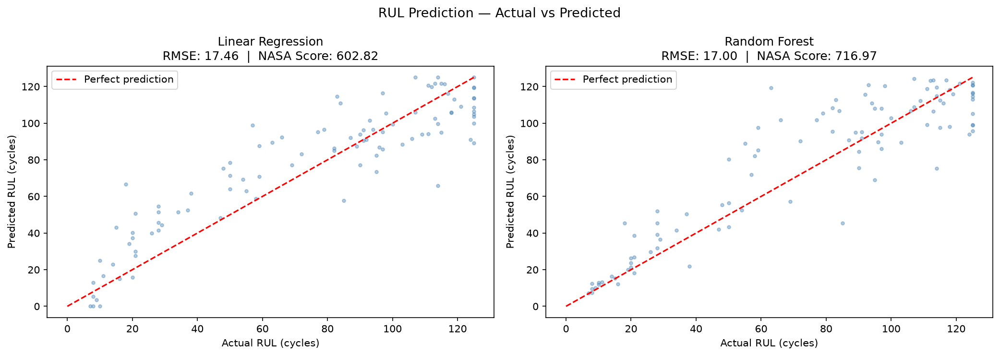
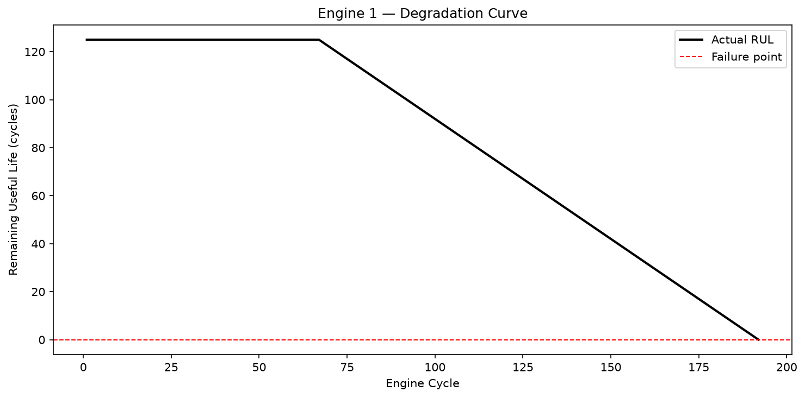
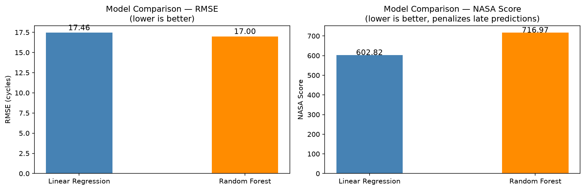

# Remaining Useful Life Prediction — NASA C-MAPSS

Predictive maintenance pipeline that predicts the Remaining Useful Life (RUL)
of turbofan engines using NASA's C-MAPSS benchmark dataset.

## Problem Statement

Unplanned engine failure in industrial and aerospace applications causes
significant downtime and safety risk. This project builds a data-driven
pipeline to predict how many operational cycles remain before a turbofan
engine reaches failure, enabling proactive maintenance scheduling before
failure occurs rather than in response to it.

## Dataset

NASA C-MAPSS (Commercial Modular Aero-Propulsion System Simulation)
FD001 subset - 100 training engines, 100 test engines, 21 sensors,
single operating condition, single fault mode.
Source: NASA Prognostics Data Repository

## Methodology

**1. Sensor selection**
Dropped 7 near-zero variance sensors (s1, s5, s6, s10, s16, s18, s19)
verified by inspecting standard deviation across the full dataset.
Constant sensors carry no degradation signal and add noise.

**2. Feature engineering**
Computed rolling mean and rolling standard deviation over a 30-cycle
window per engine, grouped by unit_id to prevent bleeding across engines.
Rolling mean captures the degradation trend. Rolling std captures
increasing instability. Both are physically meaningful signals of wear.

**3. RUL capping**
Capped training RUL at 125 cycles. Engines with more than 125 cycles
remaining look identical in sensor data — training the model to distinguish
between 300 and 280 cycles remaining adds noise without value. This
focuses the model on the degradation curve where sensor patterns are
informative.

**4. Hyperparameter tuning**
GridSearchCV with 5-fold cross-validation on training data only.
Parameters searched: n_estimators (50/100/200), max_depth (None/10/20),
min_samples_leaf (1/2/4).

**5. Evaluation metrics**
Two metrics reported per NASA benchmark protocol:

- **RMSE** — standard regression error in cycles
- **NASA Asymmetric Score** — official benchmark scoring function that
  penalizes late predictions (predicted RUL > actual RUL) exponentially
  more than early predictions. Late predictions are far more dangerous
  in real maintenance since they delay necessary intervention.

  Formula:
  - If d < 0 (early): exp(-d/13) - 1
  - If d > 0 (late):  exp(d/10) - 1

  where d = predicted RUL - actual RUL

## Results

| Model             | RMSE (cycles) | NASA Score | Notes                        |
|-------------------|--------------|------------|------------------------------|
| Linear Regression | 17.46        | 602.82          | Baseline                     |
| Random Forest     | 17        | 716.97          | GridSearchCV tuned           |

## Output Visualizations

**RUL Prediction — Actual vs Predicted (both models)**
![RUL Comparison] 

**Engine Degradation Curve — RUL over operational lifetime**
![Degradation Curve] 

**Model Comparison — RMSE and NASA Score**
![RMSE Comparison] 

## Project Structure

```
nasa-cmapss-rul/
├── data/               # Dataset files 
│   ├── train_FD001.txt
│   ├── test_FD001.txt
│   └── RUL_FD001.txt
├── src/
│   ├── load_data.py    # Data loading and RUL label generation
│   ├── features.py     # Sensor selection and rolling feature engineering
│   ├── model.py        # Training, GridSearchCV tuning, NASA score
│   └── visualize.py    # All output plots
├── outputs/            # Generated plots
├── main.py             # Pipeline entry point
└── README.md
```

## Tech Stack

Python, Pandas, NumPy, Scikit-learn (RandomForest, GridSearchCV,
StandardScaler), Matplotlib

## How to Run

```bash
git clone https://github.com/KatyalJatin28/Remaining_Useful_Life_Prediction-
cd nasa-cmapss-rul-prediction
```

Download dataset from the NASA Prognostics Data Repository and place
train_FD001.txt, test_FD001.txt, and RUL_FD001.txt in the data/ folder.

```bash
python main.py
```

GridSearchCV runs 5-fold CV across 27 parameter combinations.
Expected runtime: 2–4 minutes on a standard laptop.
All outputs saved to outputs/ folder.
